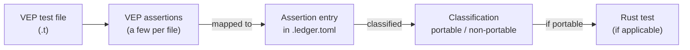

# vepyr-porting-tests

This repository is the curated home for porting tests from
[Ensembl VEP](https://github.com/Ensembl/ensembl-vep) to
[vepyr](https://github.com/biodatageeks/vepyr).

Ensembl VEP annotates variants from genome sequencing data (Perl).
vepyr is a Rust port of Ensembl VEP. Here we land **data-problem** tests
one curated assertion at a time: each checks that vepyr produces predictable
results on real annotation data.

## ./run_tests

`./run_tests` is the single entry point for this repository's tooling
(`uv` + `tools/run_tests/`).

```bash
./run_tests --help
./run_tests --list
./run_tests --cache-dir /mnt/hf-cache --add-contigs chr21,chrMT
./run_tests --cache-dir /mnt/hf-cache --vepyr 0.7.0
# or, after a fetch:
export VEPYR_CACHE_ROOT=/mnt/hf-cache
./run_tests --vepyr 0.7.0
# omit --vepyr to run against biodatageeks/vepyr master HEAD as it stands now:
./run_tests
```

| Flag | Status in this commit |
|------|------------------------|
| `--help` | Exit 0 |
| `--list` | Lists the `tests/data_*.rs` targets present in the working tree; exit 0 |
| `--cache-dir DIR` | Downloads the pinned VEP 116 shards into `DIR` and writes `PROVENANCE.json`; then runs data-tests when targets exist |
| `--add-contigs LIST` | Adds the named contigs to `DIR` (not `--contigs`). Default: whole genome |
| `--flavours LIST` | Default `ensembl,refseq,merged` |
| `--dry-run` | Lists Hub files and byte totals; writes nothing; does not run tests |
| `--verify` | Checks every selected shard against the Hub sha256 |
| `--fast` | Sets `HF_XET_HIGH_PERFORMANCE=1` for the download (see below) |
| `--no-trim-manifests` | Leaves `chrom_manifest.json` naming shards that were not fetched |
| `--vepyr REF` | Resolves `REF` on biodatageeks/vepyr and path-patches that revision's dfbf/formats ladder. **Optional:** omitted, data-tests run against `master`'s current HEAD; the summary prints the full 40-char resolved sha either way. Pass `REF` whenever a pinned, reproducible run is wanted (CI, bisecting, ledger evidence) |

**"Targets" means cargo test targets** — the `tests/data_*.rs` files. One file is
one target, named by its stem (`tests/data_foo.rs` → `data_foo`), and each becomes
one `--test data_foo` argument in the `cargo test` invocation. `--list` prints
exactly that set.

**`--vepyr REF` examples.** `REF` is anything `biodatageeks/vepyr` can dereference:

```bash
./run_tests --vepyr 0.7.0     # a tag — note there is NO `v` prefix
./run_tests --vepyr 1f0c3a9   # a commit sha, short…
./run_tests --vepyr 1f0c3a9e4b7d2c5a8f6013b9d4e27ca5f80b6d31   # …or full 40-char
./run_tests --vepyr master    # a branch (resolved to its HEAD at run time)
./run_tests                   # omitted: same as `--vepyr master`, resolved per run
```

Engine ladder checkouts run with `GIT_LFS_SKIP_SMUDGE=1`: the crates are built from
Rust source only, so the fetch never depends on unrelated git-lfs-hosted content.

Omitting the flag is **not** "no engine": it resolves `biodatageeks/vepyr`'s
`master` HEAD as it stands at that moment. The summary prints the resolved 40-char
sha in every case. How that resolution works end to end is documented in
[docs/dynamic-vepyr-version-resolving.md](docs/dynamic-vepyr-version-resolving.md).

Every real fetch (not `--dry-run`) also downloads the GRCh38 FASTA into
`DIR/fasta/`, checks it against the `[grch38_fasta]` pin, and writes the `.fai`
index.

`--fast` needs no Hugging Face login for these public pins: just pass the flag
(e.g. `./run_tests --cache-dir DIR --add-contigs chr21 --fast`). It only raises
Xet download concurrency/buffers via `hf_xet` (already pulled in with
`huggingface-hub`). Use it on a high-bandwidth host with plenty of RAM
(Hugging Face recommends about 64 GB); on a smaller machine leave it off.

Exit codes: `0` ok, `1` data-tests failed, `2` usage (missing cache),
`3` revision clash vs `PINS.toml`, `4` incomplete selection or missing cache
pieces, `5` verification failure, `6` engine resolve/checkout failure. Every run
ends with a summary of effective flags, the cache directory, targets, the
contigs accumulated per flavour, and the `vepyr sha` line naming the exact
40-char revision the run tested against.

Without a cache root (`--cache-dir` or `$VEPYR_CACHE_ROOT`), an invocation
(without `--help` / `--list`) exits 2. With targets present, the cargo run needs
no `--vepyr`: the ref defaults to `biodatageeks/vepyr`'s `master` HEAD, resolved
per run and reported as `vepyr sha` in the summary. That default is deliberately
floating — a run today and a run tomorrow can test different engine code — so
pin `--vepyr REF` for anything that must be reproducible.

## ./issue_check (pre-work issue gate)

`./issue_check --body-file PATH` reads an issue body and answers one question: does it
have a heading matching `/acceptance criteria/i`, and does that section contain at
least one code span or fenced code block? The section runs to the next heading of the
same or a higher level, so `### AC-N` sub-sections — their headings included — are part
of it.

```bash
./issue_check --body-file tools/fixtures/issue_check/valid.md               # exit 0
./issue_check --body-file tools/fixtures/issue_check/prose_only_criteria.md # exit 1
gh issue view 74 --json body --jq .body > body.md && ./issue_check --body-file body.md
```

Exit codes describe the checker: `0` compliant, `1` not compliant, `2` invoked wrong
(bad flag, unreadable or non-UTF-8 `--body-file`). It is a presence check, not a
meaning check: it does not judge whether the criteria are good, whether a backticked
span is a command, and it never runs them — a criterion may expect any exit code or be
semi-manual. `.github/workflows/issue-check.yml` runs it on `issues`
(opened/edited/labeled) and on `workflow_dispatch`; it blocks nothing, the result is
visible in Actions only.

## ./bless

`./bless` makes and checks the oracle of a data-test directory `tests/data/<name>/`:
`expected_output.vcf`, the real output of native VEP 116 on the directory's
normalised `input.vcf` (made by `tools/normalize_input`, #85). It runs Ensembl's
official image `ensemblorg/ensembl-vep:release_116.0`, always with the same command:

```
vep --offline --cache --dir_cache <CACHE> --species homo_sapiens --cache_version 116 \
    --assembly GRCh38 --fasta <FASTA> --vcf --input_file input.vcf \
    --output_file expected_output.vcf --force_overwrite
```

Three modes:

| Command | Needs | Does |
|---------|-------|------|
| `./bless CACHE FASTA <dir>` | Docker, cache, FASTA | Runs VEP, writes `expected_output.vcf`, fills `[vep]` and `[compare] body_md5` in `test.toml` |
| `./bless --check <dir>` | only the repo | Recomputes the md5 of the body (lines not starting with `#`) of `expected_output.vcf` on disk and compares it with `[compare] body_md5`. No Docker, no cache, changes nothing |
| `./bless --check --reproduce CACHE FASTA <dir>` | Docker, cache, FASTA | Re-runs the image recorded in `[vep] image` into a temp directory and compares that fresh body md5 with `[compare] body_md5`. Changes nothing |

`--check` is the cheap integrity check anyone can run when reviewing a PR: it
catches an oracle that was hand-edited or corrupted after it was blessed.
`--check --reproduce` is the expensive audit: it proves the file is still derivable
from the pinned image, cache and input, not just unedited. It is opt-in.

**Cache and FASTA.** A bless and `--check --reproduce` need exactly one flag from each
pair. There is no default path and no environment variable; neither or both flags of
a pair exits 1 with a message naming the pair.

| Flag | Meaning |
|------|---------|
| `--vep-cache-dir PATH` | An existing VEP cache root (the directory that holds `homo_sapiens/116_GRCh38/`). It must be complete: `info.txt` and the directories `1`–`22`, `X`, `Y`, `MT`. An incomplete cache exits 1 naming what is missing; nothing is fetched or written into it |
| `--download-vep-cache-to-dir PATH` | Fetches `homo_sapiens_vep_116_GRCh38.tar.gz` (27.6 GB) from `https://ftp.ensembl.org/pub/release-116/variation/indexed_vep_cache/`, checks it against Ensembl's `CHECKSUMS` value pinned in `tools/bless/ensembl.py`, unpacks it into `PATH`, then uses it, all in the same run |
| `--vep-fasta PATH` | An existing uncompressed GRCh38 FASTA. A missing, unreadable or gzipped file exits 1. A `.fai` index is written next to it when absent |
| `--download-vep-fasta-to PATH` | Fetches `Homo_sapiens.GRCh38.dna.primary_assembly.fa.gz` from `https://ftp.ensembl.org/pub/release-116/fasta/homo_sapiens/dna/`, checks it the same way, decompresses it to `PATH`, then uses it |

```bash
# an existing cache and FASTA (e.g. on vepyr-tests-01, or a previous download)
./bless --vep-cache-dir ~/vep-cache --vep-fasta ~/GRCh38.fa tests/data/NAME
# fetch both first, in the same run
./bless --download-vep-cache-to-dir ~/vep-cache --download-vep-fasta-to ~/GRCh38.fa tests/data/NAME
# mixed: existing cache, fetched FASTA
./bless --vep-cache-dir ~/vep-cache --download-vep-fasta-to ~/GRCh38.fa tests/data/NAME
```

Downloads run as parallel HTTP range requests (Ensembl's FTP is slow per
connection) and resume: re-running the same command after an interruption keeps the
chunks already fetched. A path filled by a `--download-...` flag is ordinary local
state afterwards; pass it to `--vep-cache-dir`/`--vep-fasta` next time and nothing is
downloaded. `bless` does not remember paths; the flags are the only state.

**`--dry-run`** prints the planned steps (`# fetch ...` for each download, the copy of
`input.vcf` into a temp directory) and the exact `docker run ... vep ...` command,
then exits 0 without running anything. For a bless it shows the tag
`ensemblorg/ensembl-vep:release_116.0`; the real run resolves it to a digest first.

**What a bless records** in `test.toml`:

```toml
[vep]
image = "ensemblorg/ensembl-vep@sha256:..."   # the digest that ran, never the tag
command = "vep --offline --cache --dir_cache /opt/vep/.vep ..."  # paths inside the container
date = "2026-09-23"
cache_source = "https://ftp.ensembl.org/pub/release-116/variation/indexed_vep_cache/homo_sapiens_vep_116_GRCh38.tar.gz"
cache_checksum = "sha256:... sum:56036 26996736"
fasta_source = "https://ftp.ensembl.org/pub/release-116/fasta/homo_sapiens/dna/Homo_sapiens.GRCh38.dna.primary_assembly.fa.gz"
fasta_checksum = "sha256:... sum:22450 861294"
[compare]
body_md5 = "..."
```

The source and checksum come from a `.bless-source.toml` record that a download
leaves next to the cache/FASTA. A cache or FASTA that `bless` did not download
is recorded as `local:<path>` with checksum `unverified`.

**From scratch on a plain machine** (Docker, network, about 60 GB free; no
`vepyr-tests-01`, no existing cache):

```bash
git clone https://github.com/biodatageeks/vepyr-porting-tests && cd vepyr-porting-tests
tools/normalize_input raw.vcf.gz tests/data/my_test        # writes input.vcf + [input]
./bless --download-vep-cache-to-dir ~/vep116 --download-vep-fasta-to ~/GRCh38.fa tests/data/my_test
./bless --check tests/data/my_test                           # exit 0
./bless --check --reproduce --vep-cache-dir ~/vep116 --vep-fasta ~/GRCh38.fa tests/data/my_test
```

**Work directory.** Each VEP run copies `input.vcf` into its own `bless-*`
directory created under `--docker-work-dir PATH`, which is bind-mounted into the
container and removed afterwards. Without the flag it is `<repo-root>/.bless/`
(located from the script, not the current directory; listed in `.gitignore`),
mirroring `./run_tests`'s `<repo-root>/.run_tests/`. There is no environment
fallback (`TMPDIR` is not used). If the repo checkout itself is not in a
Docker-Desktop-shared location, pass `--docker-work-dir` at a path that is, just as
`--vep-cache-dir` and `--vep-fasta` must be.

**Docker Desktop (macOS).** The cache, the FASTA's directory and the work
directory are bind-mounted into the container, so they must be inside a directory
listed under Settings > Resources > File sharing. Before any download, `bless`
probes each path from inside a container and exits 1 naming the first one Docker
cannot see, so an unshared `--download-vep-cache-to-dir` fails in seconds, not
after a 27 GB fetch.

`bless` refuses a directory whose `test.toml` `[input]` table does not carry the
`tools/normalize_input` command. It does not read issue bodies and never logs into
another machine: to use `vepyr-tests-01`'s cache, log in there and run the same
command with its local paths.

Exit codes: `0` success (for `--check`, the hash matches), `1` any failure, always
with one `bless: ...` line on stderr naming the problem, `2` usage (unknown flag,
no `<test-dir>`).

## tests/common (cache + assertion helpers)

Fetch a cache, then point `$VEPYR_CACHE_ROOT` at the same directory (or pass
`--cache-dir` to `./run_tests` together with `--vepyr`):

```bash
./run_tests --cache-dir /mnt/hf-cache --add-contigs chr21,chrMT
export VEPYR_CACHE_ROOT=/mnt/hf-cache
./run_tests --vepyr 0.7.0
# helpers type-check (and floating engine deps resolve) with:
cargo check --tests
```

Shared modules under `tests/common/`: `cache` / `ledger` (issue #5), plus
`annotate`, `csq`, and `provenance` for data-problem pilots (issue #14). Data-tests
live as `tests/data_*.rs` and are discovered by `./run_tests --list`.

`tools/normalize_input <raw> <test-dir>` writes a data-test's `input.vcf` with
the one fixed `bcftools norm -m -both` command (issue #85) and requires exactly
**bcftools 1.23 on htslib 1.23.1** — the toolchain the oracles were generated
with — refusing any other version before it touches the test directory. VEP and vepyr
always read that same normalised `input.vcf`; a data-test directory does not
store the raw pre-normalisation file (rationale: issue #90).

### Caveats

**Windows.** `./run_tests` is a bash script (it bootstraps `uv` and then runs
`tools/run_tests/`), so it needs a POSIX shell: use Git Bash or WSL. `cmd.exe` and
PowerShell cannot execute it directly.

**Accumulation.** `--add-contigs` only adds shards; it never removes earlier
ones. `chr21,chr22` then `chr15,chrY` leaves all four on disk. For a wholly
different set, use a fresh `--cache-dir` or clean the directory yourself.

**Illegal / incomplete contig sets.** Every cache entity must get at least one
requested contig. `motif` and `regulatory` have no `chrMT`, so
`--add-contigs chrMT` alone is refused (exit 4). Legal minimal examples:
`chrY`, or `chr21,chrMT` (`chr21` covers the entities that lack `chrMT`).

The sections below describe the **porting method** used to extract, classify,
and implement those tests. Code and ledger fragments are **illustrative**.

## Porting method

In the Ensembl VEP test suite there are 1970 assertions across 49 `t/*.t`
files. They were all extracted as a source corpus.



**Illustrative** — original Perl test fragment:

```perl
## BASIC TESTS
##############

# use test
use_ok('Bio::EnsEMBL::VEP::CacheDir');

# need to get a config object for further tests
use_ok('Bio::EnsEMBL::VEP::Config');

my $cfg_hash = $test_cfg->base_testing_cfg;

my $cfg = Bio::EnsEMBL::VEP::Config->new($cfg_hash);
ok($cfg, 'get new config object');

my $cd = Bio::EnsEMBL::VEP::CacheDir->new({config => $cfg, root_dir => $cfg_hash->{dir}});
ok($cd, 'new is defined');

is(ref($cd), 'Bio::EnsEMBL::VEP::CacheDir', 'check class');
```

Extracted assertions are stored as ledger entries in `.toml` files (in the
source method), formatted like the example below.

**Illustrative** — ledger assertion entry:

```toml
[[assertion]]
n               = 4
perl_line       = 42
perl_kind       = "ok"
desc            = "BASIC TESTS: CacheDir->new({config, root_dir}) resolves and accepts the v84 test cache"
category        = "analog-port"
coverage_area   = "annotation-source-setup"
rust_test       = "tests/port_cache_dir.rs::provider_accepts_a_v84_shaped_cache_root"
rationale       = "Not a bare truthiness probe: `new` calls `init` (CacheDir.pm:113) whose first statement is `my $dir = $self->dir` (CacheDir.pm:221), so this line asserts that directory resolution succeeded for the base testing config. vepyr has no CacheDir object; the constructor that consumes a cache directory is `TranscriptTableProvider::new(EnsemblCacheOptions{..})`, and the defined/undef distinction becomes `Ok`/`Err` — a different channel, hence analog-port. The named test rebuilds ensembl-vep's own `homo_sapiens/84_GRCh38` layout in a tempdir, constructs the provider and asserts it resolved the three chromosome directories. It is also the positive control for n=12, n=13 and n=14, whose negative arms use the same fixture."
vep116_delta    = "unchanged"
```

Each assertion is classified into one of six categories:
`unit-port`, `analog-port`, `failed`, `deferred`, `no-feature`, `vepyr-only`.
Classification fields stored with the assertion include:

- `category` — how the assertion maps from Ensembl VEP to vepyr
- `coverage_area` — short identifier for the feature area
- `rust_test` — Rust test path/name, if any
- `rationale` — freeform justification of the classification and mapping
- `vep116_delta` — change notes since Ensembl VEP release 116

From portable classifications, corresponding Rust tests are created.

**Illustrative** — Rust test fragment:

```rust
/// Ledger n=4 — the constructor accepts a well-formed cache directory.
#[test]
fn provider_accepts_a_v84_shaped_cache_root() {
    let (_tmp, leaf) = v84_cache();
    let provider = TranscriptTableProvider::new(ensembl_options(&leaf))
        .expect("v84-shaped cache root is accepted");
    assert_eq!(
        provider.chromosomes(),
        Some(v84_chroms().as_slice()),
        "the transcript entity resolves to the three chromosome directories",
    );
}
```

This repository will carry a curated subset of those ports as data-problem
tests.

Corpus dataset pins (`PINS.toml`) are documented in
[docs/dataset-pins.md](docs/dataset-pins.md).
