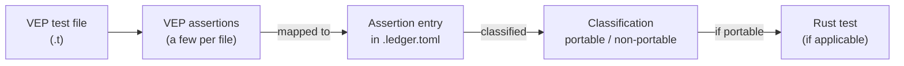

# vepyr-porting-tests

This repository is the curated home for porting tests from
[Ensembl VEP](https://github.com/Ensembl/ensembl-vep) to
[vepyr](https://github.com/biodatageeks/vepyr).

Ensembl VEP annotates variants from genome sequencing data (Perl).
vepyr is a Rust port of Ensembl VEP. Here we land **data-problem** tests
one curated assertion at a time: each checks that vepyr produces predictable
results on real annotation data.

## ./run_tests

`./run_tests` is the single entry point for this repository's tooling
(`uv` + `tools/run_tests/`).

```bash
./run_tests --help
./run_tests --list
```

| Flag | Status in this commit |
|------|------------------------|
| `--help` | Works; exit 0 |
| `--list` | Works; prints **0 data-problem targets**; exit 0 |
| `--cache-dir DIR` | Parsed; any run path that is not `--help`/`--list` refuses (exit 2) |
| `--add-contigs LIST` | Parsed (not `--contigs`); same refuse until fetch lands |
| `--flavours LIST` | Parsed (default `ensembl,refseq,merged`); same refuse |
| `--vepyr REF` | Parsed; engine checkout not implemented yet |

Cache fetch and data-problem test runs are **not implemented yet** (see
[issue #4](https://github.com/biodatageeks/vepyr-porting-tests/issues/4)).
A non-`--help` / non-`--list` invocation exits 2 with:

```text
run_tests: cache fetch and data-problem runs are not implemented yet (see issue #4)
```

The sections below describe the **porting method** used to extract, classify,
and implement those tests. Code and ledger fragments are **illustrative**.

## Porting method

In the Ensembl VEP test suite there are 1970 assertions across 49 `t/*.t`
files. They were all extracted as a source corpus.



**Illustrative** — original Perl test fragment:

```perl
## BASIC TESTS
##############

# use test
use_ok('Bio::EnsEMBL::VEP::CacheDir');

# need to get a config object for further tests
use_ok('Bio::EnsEMBL::VEP::Config');

my $cfg_hash = $test_cfg->base_testing_cfg;

my $cfg = Bio::EnsEMBL::VEP::Config->new($cfg_hash);
ok($cfg, 'get new config object');

my $cd = Bio::EnsEMBL::VEP::CacheDir->new({config => $cfg, root_dir => $cfg_hash->{dir}});
ok($cd, 'new is defined');

is(ref($cd), 'Bio::EnsEMBL::VEP::CacheDir', 'check class');
```

Extracted assertions are stored as ledger entries in `.toml` files (in the
source method), formatted like the example below.

**Illustrative** — ledger assertion entry:

```toml
[[assertion]]
n               = 4
perl_line       = 42
perl_kind       = "ok"
desc            = "BASIC TESTS: CacheDir->new({config, root_dir}) resolves and accepts the v84 test cache"
category        = "analog-port"
coverage_area   = "annotation-source-setup"
rust_test       = "tests/port_cache_dir.rs::provider_accepts_a_v84_shaped_cache_root"
rationale       = "Not a bare truthiness probe: `new` calls `init` (CacheDir.pm:113) whose first statement is `my $dir = $self->dir` (CacheDir.pm:221), so this line asserts that directory resolution succeeded for the base testing config. vepyr has no CacheDir object; the constructor that consumes a cache directory is `TranscriptTableProvider::new(EnsemblCacheOptions{..})`, and the defined/undef distinction becomes `Ok`/`Err` — a different channel, hence analog-port. The named test rebuilds ensembl-vep's own `homo_sapiens/84_GRCh38` layout in a tempdir, constructs the provider and asserts it resolved the three chromosome directories. It is also the positive control for n=12, n=13 and n=14, whose negative arms use the same fixture."
vep116_delta    = "unchanged"
```

Each assertion is classified into one of six categories:
`unit-port`, `analog-port`, `failed`, `deferred`, `no-feature`, `vepyr-only`.
Classification fields stored with the assertion include:

- `category` — how the assertion maps from Ensembl VEP to vepyr
- `coverage_area` — short identifier for the feature area
- `rust_test` — Rust test path/name, if any
- `rationale` — freeform justification of the classification and mapping
- `vep116_delta` — change notes since Ensembl VEP release 116

From portable classifications, corresponding Rust tests are created.

**Illustrative** — Rust test fragment:

```rust
/// Ledger n=4 — the constructor accepts a well-formed cache directory.
#[test]
fn provider_accepts_a_v84_shaped_cache_root() {
    let (_tmp, leaf) = v84_cache();
    let provider = TranscriptTableProvider::new(ensembl_options(&leaf))
        .expect("v84-shaped cache root is accepted");
    assert_eq!(
        provider.chromosomes(),
        Some(v84_chroms().as_slice()),
        "the transcript entity resolves to the three chromosome directories",
    );
}
```

This repository will carry a curated subset of those ports as data-problem
tests.

Corpus dataset pins (`PINS.toml`) are documented in
[docs/dataset-pins.md](docs/dataset-pins.md).
