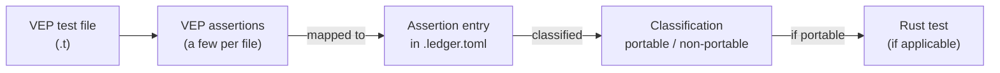

# vepyr-porting-tests

This repository is the curated home for porting tests from
[Ensembl VEP](https://github.com/Ensembl/ensembl-vep) to
[vepyr](https://github.com/biodatageeks/vepyr).

Ensembl VEP annotates variants from genome sequencing data (Perl).
vepyr is a Rust port of Ensembl VEP. Here we land **data-problem** tests
one curated assertion at a time: each checks that vepyr produces predictable
results on real annotation data.

## ./run_tests

`./run_tests` is the single entry point for this repository's tooling
(`uv` + `tools/run_tests/`).

```bash
./run_tests --help
./run_tests --list
./run_tests --cache-dir /mnt/hf-cache --add-contigs chr21,chrMT
```

| Flag | Status in this commit |
|------|------------------------|
| `--help` | Exit 0 |
| `--list` | Prints **0 data-problem targets**; exit 0 |
| `--cache-dir DIR` | Downloads the pinned VEP 116 shards into `DIR` and writes `PROVENANCE.json` |
| `--add-contigs LIST` | Adds the named contigs to `DIR` (not `--contigs`). Default: whole genome |
| `--flavours LIST` | Default `ensembl,refseq,merged` |
| `--dry-run` | Lists Hub files and byte totals; writes nothing |
| `--verify` | Checks every selected shard against the Hub sha256 |
| `--fast` | Sets `HF_XET_HIGH_PERFORMANCE=1` for the download (see below) |
| `--no-trim-manifests` | Leaves `chrom_manifest.json` naming shards that were not fetched |
| `--vepyr REF` | Parsed; engine checkout not implemented yet |

Every real fetch (not `--dry-run`) also downloads the GRCh38 FASTA into
`DIR/fasta/`, checks it against the `[grch38_fasta]` pin, and writes the `.fai`
index.

`--fast` needs no Hugging Face login for these public pins: just pass the flag
(e.g. `./run_tests --cache-dir DIR --add-contigs chr21 --fast`). It only raises
Xet download concurrency/buffers via `hf_xet` (already pulled in with
`huggingface-hub`). Use it on a high-bandwidth host with plenty of RAM
(Hugging Face recommends about 64 GB); on a smaller machine leave it off.

Exit codes: `0` ok, `2` usage, `3` revision clash vs `PINS.toml`, `4`
incomplete selection or unreachable Hub, `5` verification failure. Every fetch
run ends with a summary of effective flags, the cache directory, and the
contigs accumulated per flavour.

Data-problem **test runs** are still not implemented. An invocation without
`--cache-dir` (and without `--help` / `--list`) exits 2 with:

```text
run_tests: data-problem runs are not implemented yet; give --cache-dir to materialise the corpus, or --list
```

## tests/common (cache helpers)

`tests/common` is the only bridge future data-problem tests use to open the
HF cache under `$VEPYR_CACHE_ROOT`. Point that env var at the same directory
you pass to `./run_tests --cache-dir`. Helpers check `PROVENANCE.json` against
`PINS.toml`, enforce per-assertion `required_contigs` shards, and locate the
GRCh38 FASTA. They panic with a `Run:` repair command; they never skip.

```bash
./run_tests --cache-dir /mnt/hf-cache --add-contigs chr21,chrMT
export VEPYR_CACHE_ROOT=/mnt/hf-cache
cargo check --tests
```

### Caveats

**Accumulation.** `--add-contigs` only adds shards; it never removes earlier
ones. `chr21,chr22` then `chr15,chrY` leaves all four on disk. For a wholly
different set, use a fresh `--cache-dir` or clean the directory yourself.

**Illegal / incomplete contig sets.** Every cache entity must get at least one
requested contig. `motif` and `regulatory` have no `chrMT`, so
`--add-contigs chrMT` alone is refused (exit 4). Legal minimal examples:
`chrY`, or `chr21,chrMT` (`chr21` covers the entities that lack `chrMT`).

The sections below describe the **porting method** used to extract, classify,
and implement those tests. Code and ledger fragments are **illustrative**.

## Porting method

In the Ensembl VEP test suite there are 1970 assertions across 49 `t/*.t`
files. They were all extracted as a source corpus.



**Illustrative** — original Perl test fragment:

```perl
## BASIC TESTS
##############

# use test
use_ok('Bio::EnsEMBL::VEP::CacheDir');

# need to get a config object for further tests
use_ok('Bio::EnsEMBL::VEP::Config');

my $cfg_hash = $test_cfg->base_testing_cfg;

my $cfg = Bio::EnsEMBL::VEP::Config->new($cfg_hash);
ok($cfg, 'get new config object');

my $cd = Bio::EnsEMBL::VEP::CacheDir->new({config => $cfg, root_dir => $cfg_hash->{dir}});
ok($cd, 'new is defined');

is(ref($cd), 'Bio::EnsEMBL::VEP::CacheDir', 'check class');
```

Extracted assertions are stored as ledger entries in `.toml` files (in the
source method), formatted like the example below.

**Illustrative** — ledger assertion entry:

```toml
[[assertion]]
n               = 4
perl_line       = 42
perl_kind       = "ok"
desc            = "BASIC TESTS: CacheDir->new({config, root_dir}) resolves and accepts the v84 test cache"
category        = "analog-port"
coverage_area   = "annotation-source-setup"
rust_test       = "tests/port_cache_dir.rs::provider_accepts_a_v84_shaped_cache_root"
rationale       = "Not a bare truthiness probe: `new` calls `init` (CacheDir.pm:113) whose first statement is `my $dir = $self->dir` (CacheDir.pm:221), so this line asserts that directory resolution succeeded for the base testing config. vepyr has no CacheDir object; the constructor that consumes a cache directory is `TranscriptTableProvider::new(EnsemblCacheOptions{..})`, and the defined/undef distinction becomes `Ok`/`Err` — a different channel, hence analog-port. The named test rebuilds ensembl-vep's own `homo_sapiens/84_GRCh38` layout in a tempdir, constructs the provider and asserts it resolved the three chromosome directories. It is also the positive control for n=12, n=13 and n=14, whose negative arms use the same fixture."
vep116_delta    = "unchanged"
```

Each assertion is classified into one of six categories:
`unit-port`, `analog-port`, `failed`, `deferred`, `no-feature`, `vepyr-only`.
Classification fields stored with the assertion include:

- `category` — how the assertion maps from Ensembl VEP to vepyr
- `coverage_area` — short identifier for the feature area
- `rust_test` — Rust test path/name, if any
- `rationale` — freeform justification of the classification and mapping
- `vep116_delta` — change notes since Ensembl VEP release 116

From portable classifications, corresponding Rust tests are created.

**Illustrative** — Rust test fragment:

```rust
/// Ledger n=4 — the constructor accepts a well-formed cache directory.
#[test]
fn provider_accepts_a_v84_shaped_cache_root() {
    let (_tmp, leaf) = v84_cache();
    let provider = TranscriptTableProvider::new(ensembl_options(&leaf))
        .expect("v84-shaped cache root is accepted");
    assert_eq!(
        provider.chromosomes(),
        Some(v84_chroms().as_slice()),
        "the transcript entity resolves to the three chromosome directories",
    );
}
```

This repository will carry a curated subset of those ports as data-problem
tests.

Corpus dataset pins (`PINS.toml`) are documented in
[docs/dataset-pins.md](docs/dataset-pins.md).
